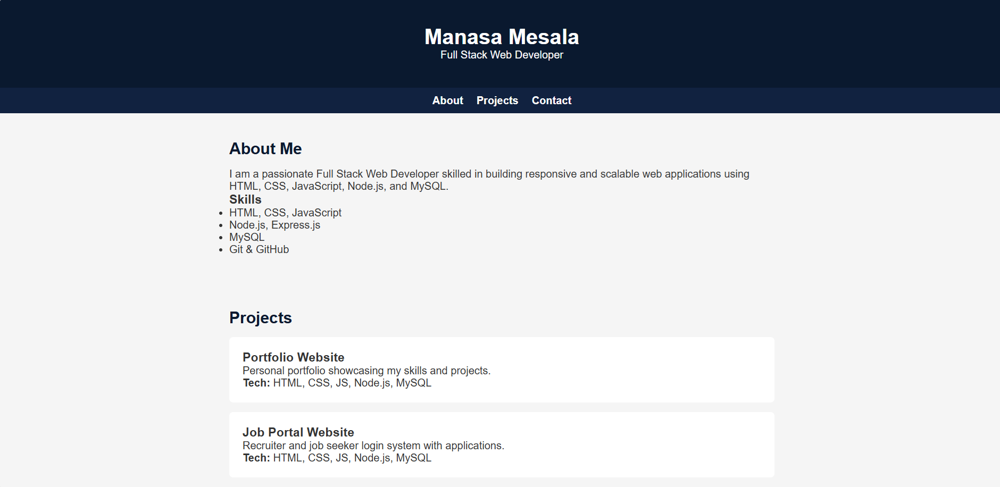
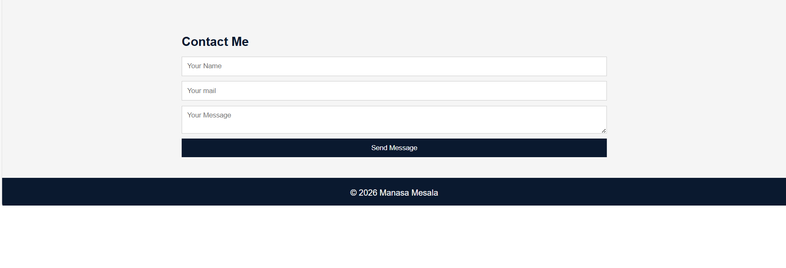

# Manasa Portfolio Website
## 📸 Project Preview

## Tech Stack
- HTML
- CSS
- JavaScript
- Node.js
- Express.js
- MySQL

## About
This is a personal portfolio website showcasing my web development skills, including backend form handling with database storage.

## Features
- Responsive portfolio design
- Contact form with backend (Express + MySQL)
- Validations and database storage

## How to Run Locally

1. Clone the repo
2. Run:
   npm install
3. Start server:
   node server.js
